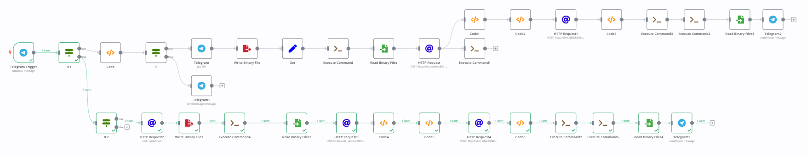
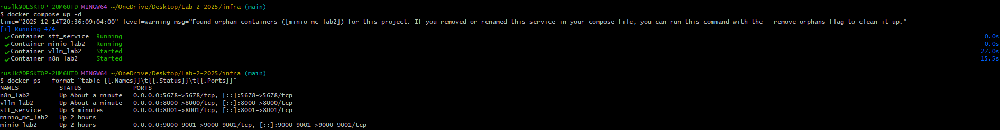
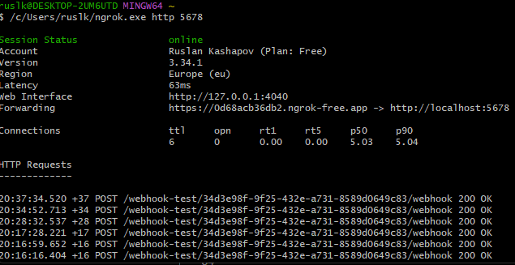
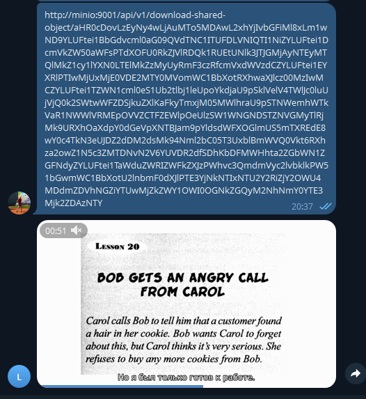
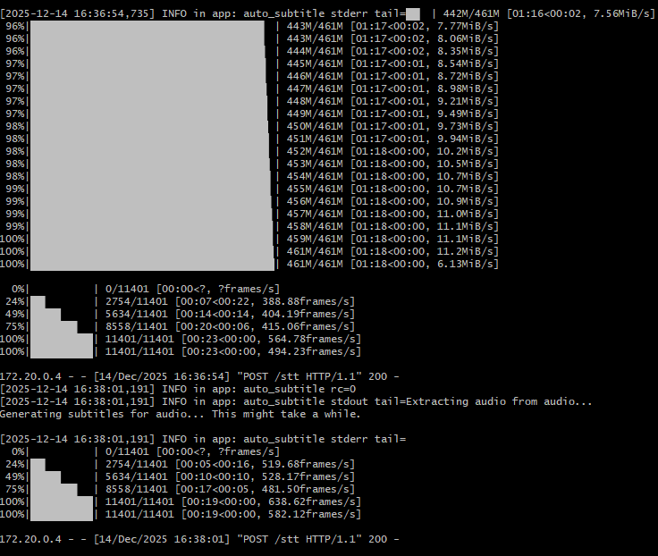
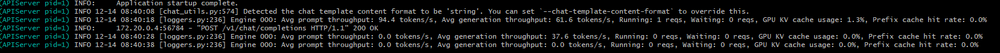

# Лабораторная работа №2
# Построение видео-пайплайна обработки субтитров с использованием n8n

# 1. Цель работы

Целью лабораторной работы является разработка автоматизированного пайплайна обработки видео, который:

 - принимает видео по ссылке или файлом через Telegram;

 - извлекает аудиодорожку;

 - генерирует английские субтитры с использованием auto_subtitle;

 - выполняет перевод субтитров EN → RU с использованием LLM;

 - встраивает русские субтитры в исходное видео;

 - возвращает итоговый видеофайл пользователю в Telegram.

 - Пайплайн должен быть реализован в виде оркестрируемого workflow и соответствовать требованиям задания.

# 2. Архитектура решения

Общая архитектура решения построена на микросервисном подходе и включает следующие компоненты:

 - n8n — оркестрация пайплайна и интеграция сервисов;

 - Telegram Bot API — точка входа (файл или ссылка);

 - ffmpeg — обработка мультимедиа (аудио и видео);

 - auto_subtitle — генерация субтитров на английском языке;

 - vLLM (OpenAI-совместимый API) — перевод субтитров EN → RU;

 - MinIO — объектное хранилище видеофайлов (режим работы по ссылке);

 - Docker Compose — запуск и управление инфраструктурой.

Логическая схема пайплайна


Контейнеры


# 3. Используемые инструменты и версии
| Компонент |   Версия   |   Примечание   |
|-----------|------------|----------------|
|n8n        | 0.222.0    |                |
|Docker     | 4.54       |                |
| ffmpeg    | 4.1        |                |
|auto_subtitle|	         |                |
| vLLM      | 0.12.0     |                |
|LLM модель	|Qwen/Qwen2.5-0.5B-Instruct-AWQ|Более новую версию не потянул GPU|
|MinIO      | latest     |                |
| Python    | 3.10       |                |

# 4. Описание пайплайна (Extract → Transform → Load)

В рамках данной лабораторной работы ETL-подход интерпретируется следующим образом:

 - Extract — получение видео и аудио данных;

 - Transform — генерация и перевод субтитров;

 - Load — встраивание субтитров и возврат видео пользователю.

### 4.1. Extract

Поддерживаются два режима входа:

 - Файл видео — полученный напрямую от пользователя в Telegram.

 - Ссылка — HTTP-URL. (При тестировании использовалась MinIO)


Для корректного взаимодействия телеграмма с n8n использовался ngrok.

Для обоих режимов видео сохраняется во временную директорию контейнера n8n:

/home/node/tmp/in.mp4


Извлечение аудио:
```bash
ffmpeg -y -i in.mp4 -vn -ac 1 -ar 16000 -c:a pcm_s16le audio.wav
```

### 4.2. Transform
### 4.2.1 Генерация EN субтитров (auto_subtitle)

Для генерации английских субтитров используется отдельный сервис stt_service, реализованный на Flask, внутри которого вызывается auto_subtitle.

```python
cmd = [
"auto_subtitle",
"--model", model,
"--language", lang,
"--output_dir", out_dir,
"--output_srt", "True",
"--srt_only", "True",
audio_path,
]

p = subprocess.run(cmd, capture_output=True, text=True)
```

Результат работы:

subs_en.srt

### 4.2.2 Перевод субтитров EN → RU (vLLM)

Перевод выполняется через OpenAI-совместимый API сервера vLLM:

POST /v1/chat/completions


Передаваемый prompt включает:

 - инструкцию сохранить номера и таймкоды;

 - текст исходных EN-субтитров.

Ограничения и решения:

 - Из-за слабой GPU, используется слабая LLM, из-за чего может возвращать лишний текст и неправильный перевод.

### 4.2.3 Очистка и сборка SRT

Для приведения ответа модели к строгому формату SRT используется Code node в n8n:

удаляются вступительные и заключительные фразы;

восстанавливается формат:

index
HH:MM:SS,mmm --> HH:MM:SS,mmm
text


извлекаются только валидные SRT-блоки с помощью регулярных выражений.

Результат:

subs_ru.srt

### 4.3. Load
Встраивание субтитров в видео
```bash
ffmpeg -y \
  -i in.mp4 \
  -vf "subtitles=subs_ru.srt:charenc=UTF-8" \
  -c:a copy \
  out.mp4
```

Итоговый файл out.mp4 содержит встроенные русские субтитры.

# 5. Обработка ошибок и устойчивость

Реализованы следующие меры:

 - проверка наличия входного файла;

 - контроль формата SRT перед встраиванием;

 - защита от превышения размера HTTP-payload (413);

 - работа только с файловыми путями вместо передачи бинарных данных в JSON;

 - логирование ошибок ffmpeg, auto_subtitle и vLLM.

Потенциальные точки сбоя:

 - превышение контекста LLM;

 - нестабильный формат ответа модели;

 - сетевые ошибки Telegram/ngrok;

 - недоступность MinIO.

# 6. Результаты работы

В результате выполнения лабораторной работы:

 - реализован полностью автоматизированный видео-пайплайн;

 - подтверждена корректная работа для обоих режимов входа (URL / файл);
  
  

 - субтитры генерируются с использованием auto_subtitle;
  
 - перевод выполняется локальной LLM;
  

 - итоговое видео успешно возвращается пользователю в Telegram.

# 7. Выводы

В ходе лабораторной работы был разработан практический пайплайн обработки видео с субтитрами, объединяющий современные инструменты оркестрации (n8n), мультимедийной обработки (ffmpeg) и LLM-модели.

Основные сложности были связаны с:

 - ограничениями контекста LLM;

 - нестабильностью формата ответа модели;

 - передачей больших файлов между сервисами.

Все проблемы были успешно решены за счёт постобработки и использования объектного хранилища.

Возможные улучшения:

 - автоматическое масштабирование vLLM;

 - поддержка многоязычных субтитров;

 - хранение истории обработок;

 - добавление метрик времени выполнения шагов.